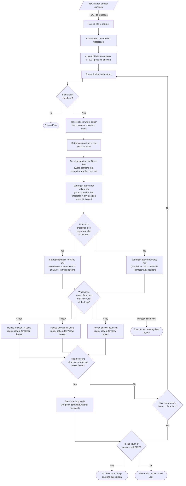

# Wordle Solver
A Go powered web app for solving Wordle puzzles.

## Description
The purpose of this app is to provide a webpage where users (who are stuck on today's Wordle problem) can enter their current guesses and receive a list of all the possible five-letter words that could potentially be the solution, after taking the characters and colors into account.

The user does by using the soft-keyboard on the page itself (or physical keyboard on desktop PCs) to enter the characters. They can then add the colors returned by Wordle by clicking on the box in each row.

The characters, colors and position of each box will then be computed in order to find all possible solutions to the puzzle (given the words that the current guesses have eliminated).

## Isn't That Cheating Though?
Oh, for _you_ it is, yes, absolutely. I mean, you're using a third-party tool to help you solve the Wordle. How can you sleep at night?

For me on the other hand, not so much. The way I see it - Wordle is a test of your mental ability to correctly deduce the answer word based on the clues provided by the characters and colors in the squares. I've simply employed my mental abilities a bit differently, in that I have built an application to help suggest possible answers. :grin:

In reality, I don't use this tool very often. Its primary purpose was to act as a project that allowed me to build up my coding skills in Go, HTML, JavaScript, etc.

## Code Logic
Below is a diagram of the logical steps made by the Wordle Solver Go code in order to return a list of possible answers:

## Prerequisites for Local Execution
- Linux
- Go 1.22

## External links
- [NYT Wordle](https://www.nytimes.com/games/wordle/index.html)
